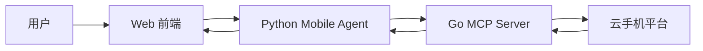
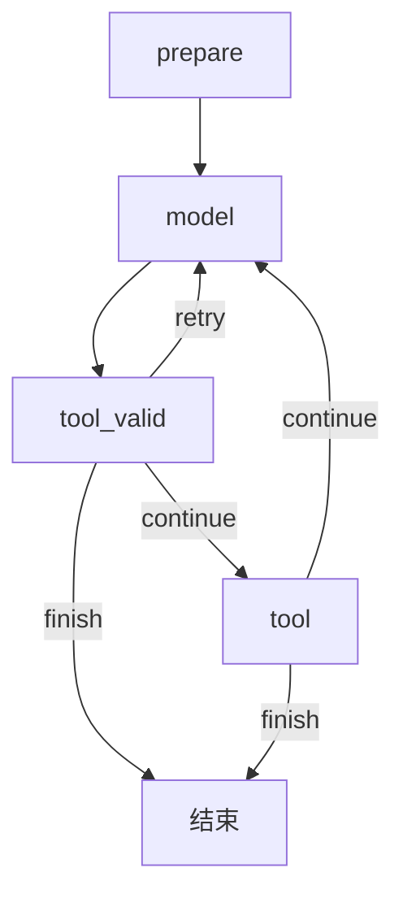
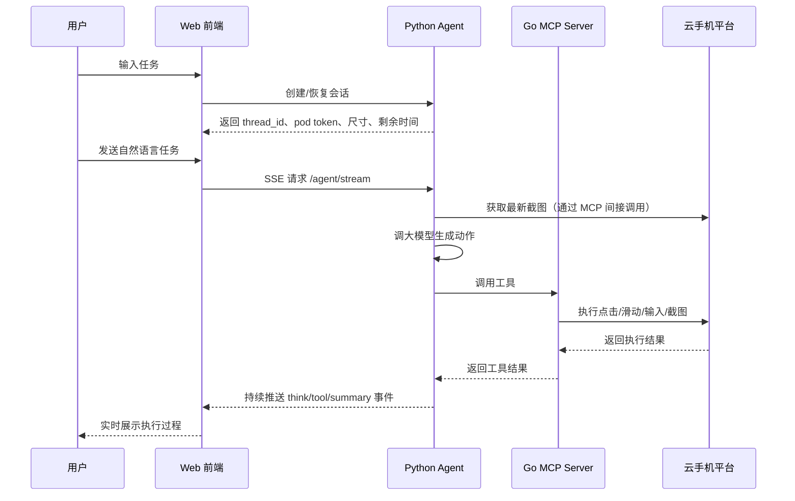
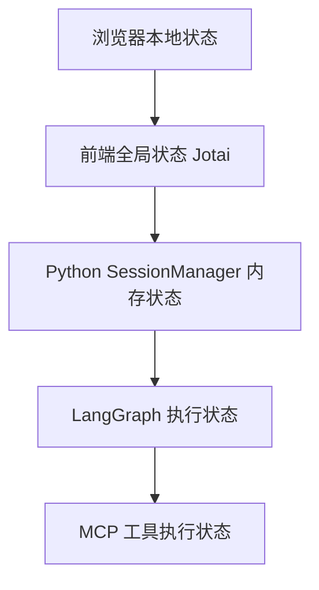

# 项目详解

## 1. 这个项目是做什么的

这个仓库实现了一个“让 AI 帮你操作云手机”的完整示例系统。

你可以把它理解成 3 个部分一起合作：

1. `web/`：网页界面。用户在这里输入任务，比如“安装某个 App 并完成某个操作”。
2. `mobile_agent/`：Python 后端。它负责理解用户目标、调用大模型、决定下一步要做什么。
3. `mobile_use_mcp/`：Go 写的 MCP 工具服务。它负责把“点击、滑动、输入文字、截图”这些动作真正发给云手机。

一句话总结：

- `web` 负责“展示和交互”
- `mobile_agent` 负责“思考和调度”
- `mobile_use_mcp` 负责“真正执行手机动作”

---

## 2. 推荐先从哪里开始读

如果你是第一次读这个项目，建议按照下面的顺序：

1. 先看 [README.md](/Users/bytedance/ai-app-lab/demohouse/mobile-use/README.md)，知道项目整体用途。
2. 再看 [web/src/app/page.tsx](/Users/bytedance/ai-app-lab/demohouse/mobile-use/web/src/app/page.tsx)，理解用户如何创建会话。
3. 然后看 [web/src/app/chat/page.tsx](/Users/bytedance/ai-app-lab/demohouse/mobile-use/web/src/app/chat/page.tsx)，理解聊天页如何恢复会话和展示云手机。
4. 再看 [web/src/lib/cloudAgent.ts](/Users/bytedance/ai-app-lab/demohouse/mobile-use/web/src/lib/cloudAgent.ts) 与 [web/src/hooks/useCloudAgent.ts](/Users/bytedance/ai-app-lab/demohouse/mobile-use/web/src/hooks/useCloudAgent.ts)，理解前端如何接收 SSE 流。
5. 接着看 [mobile_agent/mobile_agent/routers/session.py](/Users/bytedance/ai-app-lab/demohouse/mobile-use/mobile_agent/mobile_agent/routers/session.py) 和 [mobile_agent/mobile_agent/routers/agent.py](/Users/bytedance/ai-app-lab/demohouse/mobile-use/mobile_agent/mobile_agent/routers/agent.py)，理解后端如何创建会话和执行任务。
6. 再看 [mobile_agent/mobile_agent/agent/mobile_use_agent.py](/Users/bytedance/ai-app-lab/demohouse/mobile-use/mobile_agent/mobile_agent/agent/mobile_use_agent.py) 与 [mobile_agent/mobile_agent/agent/graph/nodes.py](/Users/bytedance/ai-app-lab/demohouse/mobile-use/mobile_agent/mobile_agent/agent/graph/nodes.py)，理解 Agent 的主循环。
7. 最后看 [mobile_use_mcp/internal/mobile_use/server/server.go](/Users/bytedance/ai-app-lab/demohouse/mobile-use/mobile_use_mcp/internal/mobile_use/server/server.go) 与 [mobile_use_mcp/internal/mobile_use/service/provider.go](/Users/bytedance/ai-app-lab/demohouse/mobile-use/mobile_use_mcp/internal/mobile_use/service/provider.go)，理解底层动作如何真正落到云手机平台。

这个阅读顺序的好处是：

- 先从“用户看得到的页面”入手，比较容易建立直觉
- 再进入“后端如何思考”
- 最后才进入“工具如何真正执行”

---

## 3. 目录结构说明

整个项目最重要的目录如下：

```text
mobile-use/
├── mobile_agent/          # Python 后端，负责 Agent 思考与任务调度
├── mobile_use_mcp/        # Go MCP 工具服务，负责真实云手机动作
├── web/                   # Next.js 前端页面
├── README.md              # 项目英文说明
└── PROJECT_EXPLAINED.zh-CN.md
```

### `mobile_agent/` 里有什么

```text
mobile_agent/
├── app.py                         # FastAPI 应用装配
├── main.py                        # 启动入口
└── mobile_agent/
    ├── routers/                   # HTTP 路由
    ├── middleware/                # 鉴权与统一响应包装
    ├── service/session/           # 会话状态管理
    ├── agent/mobile_use_agent.py  # Agent 顶层对象
    ├── agent/graph/               # LangGraph 主流程
    ├── agent/llm/                 # 大模型调用层
    ├── agent/tools/               # 工具注册与执行
    └── agent/mobile/              # 云手机客户端封装
```

### `mobile_use_mcp/` 里有什么

```text
mobile_use_mcp/
├── cmd/mobile_use_mcp/main.go     # Go 服务启动入口
└── internal/mobile_use/
    ├── server/                    # MCP 服务装配与鉴权上下文
    ├── tool/                      # 每个 MCP 工具的声明与处理函数
    ├── service/                   # 真正调用云手机平台 API 的实现
    └── config/                    # 工具运行时配置结构
```

### `web/` 里有什么

```text
web/src/
├── app/                           # Next.js 页面和 API route
├── components/                    # 聊天区、云手机区等组件
├── hooks/                         # 会话、SSE、倒计时等逻辑
├── lib/                           # 请求封装、CloudAgent、vePhone 封装
└── types/                         # 前后端共享类型
```

---

## 4. 三个子项目是怎么配合的

先看最重要的一张图：



这张图表示：

1. 用户在网页里输入任务。
2. 前端把任务发送给 Python Agent。
3. Python Agent 调大模型思考下一步。
4. 如果需要真实操作手机，Python Agent 会调用 Go MCP Server。
5. Go MCP Server 再去调用云手机平台的接口或命令。
6. 执行结果再一层层返回回来。
7. 前端把“思考过程”和“动作结果”实时展示给用户。

---

## 5. 一次完整任务是怎么跑起来的

下面按真实运行顺序来讲。

### 第一步：用户进入首页并创建会话

入口页面是 [web/src/app/page.tsx](/Users/bytedance/ai-app-lab/demohouse/mobile-use/web/src/app/page.tsx)。

用户会输入：

- `productId`
- `podId`

然后前端调用：

- [web/src/hooks/useCreateSession.ts](/Users/bytedance/ai-app-lab/demohouse/mobile-use/web/src/hooks/useCreateSession.ts)
- [web/src/app/api/session/create/route.ts](/Users/bytedance/ai-app-lab/demohouse/mobile-use/web/src/app/api/session/create/route.ts)

再转发到 Python 后端：

- [mobile_agent/mobile_agent/routers/session.py](/Users/bytedance/ai-app-lab/demohouse/mobile-use/mobile_agent/mobile_agent/routers/session.py)

这一步的目标不是“立刻执行任务”，而是先把运行任务所需的上下文准备好，包括：

- 当前会话的 `thread_id`
- Agent 内部对话用的 `chat_thread_id`
- pod 的尺寸信息
- pod 的 token
- 剩余体验时间

### 第二步：前端进入聊天页并初始化云手机

聊天页在 [web/src/app/chat/page.tsx](/Users/bytedance/ai-app-lab/demohouse/mobile-use/web/src/app/chat/page.tsx)。

它会做几件事：

1. 检查浏览器里是否已经有 `threadId`
2. 检查全局状态里是否有 `sessionData`
3. 如果没有，就重新请求一次创建会话接口
4. 把 pod token、尺寸、账号等信息交给 vePhone 客户端
5. 启动倒计时

这一步的核心目标是：

- 左边准备聊天区
- 右边准备云手机画面

### 第三步：用户发送任务

发送消息主要发生在：

- [web/src/components/chat/ChatPanel.tsx](/Users/bytedance/ai-app-lab/demohouse/mobile-use/web/src/components/chat/ChatPanel.tsx)
- [web/src/components/chat/InputArea.tsx](/Users/bytedance/ai-app-lab/demohouse/mobile-use/web/src/components/chat/InputArea.tsx)
- [web/src/lib/cloudAgent.ts](/Users/bytedance/ai-app-lab/demohouse/mobile-use/web/src/lib/cloudAgent.ts)

前端会先把用户消息加入本地消息列表，然后发起 SSE 请求：

- `/api/agent/stream`

这个浏览器侧 route 又会转发到 Python 后端的：

- [mobile_agent/mobile_agent/routers/agent.py](/Users/bytedance/ai-app-lab/demohouse/mobile-use/mobile_agent/mobile_agent/routers/agent.py)

### 第四步：Python Agent 开始思考

Python 侧的主入口是：

- [mobile_agent/mobile_agent/agent/mobile_use_agent.py](/Users/bytedance/ai-app-lab/demohouse/mobile-use/mobile_agent/mobile_agent/agent/mobile_use_agent.py)

它会做两件很重要的事：

1. 创建本次任务的运行上下文
2. 启动 LangGraph 执行图

执行图定义在：

- [mobile_agent/mobile_agent/agent/graph/builder.py](/Users/bytedance/ai-app-lab/demohouse/mobile-use/mobile_agent/mobile_agent/agent/graph/builder.py)

主要节点在：

- [mobile_agent/mobile_agent/agent/graph/nodes.py](/Users/bytedance/ai-app-lab/demohouse/mobile-use/mobile_agent/mobile_agent/agent/graph/nodes.py)

可以把它理解成下面这个循环：



每个节点在干什么：

- `prepare`：准备上下文、注入 system prompt、先发一个“思考中”占位消息
- `model`：截图、拼消息、调用大模型，让模型决定下一步
- `tool_valid`：把模型产出的动作字符串解析成真正的工具调用
- `tool`：执行工具，例如截图、点击、滑动、输入文字

### 第五步：Go MCP 工具服务执行真实动作

如果 Agent 决定调用工具，它会走到 Go 侧的 MCP 服务。

入口是：

- [mobile_use_mcp/cmd/mobile_use_mcp/main.go](/Users/bytedance/ai-app-lab/demohouse/mobile-use/mobile_use_mcp/cmd/mobile_use_mcp/main.go)

服务装配在：

- [mobile_use_mcp/internal/mobile_use/server/server.go](/Users/bytedance/ai-app-lab/demohouse/mobile-use/mobile_use_mcp/internal/mobile_use/server/server.go)

这里会注册很多工具，比如：

- `take_screenshot`
- `text_input`
- `tap`
- `swipe`
- `launch_app`
- `close_app`

工具处理函数在：

- [mobile_use_mcp/internal/mobile_use/tool/](/Users/bytedance/ai-app-lab/demohouse/mobile-use/mobile_use_mcp/internal/mobile_use/tool/)

真正操作云手机的平台调用在：

- [mobile_use_mcp/internal/mobile_use/service/provider.go](/Users/bytedance/ai-app-lab/demohouse/mobile-use/mobile_use_mcp/internal/mobile_use/service/provider.go)

也就是说：

- `tool/*.go` 负责把 MCP 请求翻译成内部调用
- `provider.go` 负责把内部调用翻译成云手机平台 API 或命令

---

## 6. 数据是怎么流动的

下面这张图专门讲“数据从哪里来，到哪里去”：



这张图里最关键的一点是：

- 前端并不是只等“最后答案”
- 它会不断接收中间过程

所以用户能看到：

- Agent 正在思考什么
- 它调用了哪个工具
- 工具执行结果是什么

---

## 7. 前端里最值得先理解的几个对象

### `CloudAgent`

文件：

- [web/src/lib/cloudAgent.ts](/Users/bytedance/ai-app-lab/demohouse/mobile-use/web/src/lib/cloudAgent.ts)

它是浏览器侧最重要的“客户端管家”。

主要负责：

- 记住 `threadId`、`chatThreadId`、`podId`、`productId`
- 发起 SSE 请求
- 取消正在执行的任务
- 解析 `data: ...` 格式的 SSE 消息

### `useCloudAgentInit`

文件：

- [web/src/hooks/useCloudAgent.ts](/Users/bytedance/ai-app-lab/demohouse/mobile-use/web/src/hooks/useCloudAgent.ts)

它负责把后端 SSE 事件转成前端 UI 消息。

例如：

- `think` 事件变成思考步骤
- `tool` 事件变成工具调用步骤
- `summary` 事件变成总结内容

### Jotai atoms

文件：

- [web/src/app/atom.ts](/Users/bytedance/ai-app-lab/demohouse/mobile-use/web/src/app/atom.ts)

这里保存的是整个前端共享状态，例如：

- 当前消息列表
- 当前会话数据
- 当前云手机客户端
- 倒计时状态

如果你以前没接触过 atom，可以先把它理解成“很多个很小的全局变量”。

---

## 8. 后端里最值得先理解的几个对象

### `SessionManager`

文件：

- [mobile_agent/mobile_agent/service/session/manager.py](/Users/bytedance/ai-app-lab/demohouse/mobile-use/mobile_agent/mobile_agent/service/session/manager.py)

它负责：

- 创建会话
- 更新会话
- 重置 chat 线程
- 清理过期会话
- 保存 pod 信息和 token

它的重要性很高，因为没有它，前端就不知道当前在操作哪台云手机，Agent 也不知道该把动作发给谁。

### `AgentObjectManager`

文件：

- [mobile_agent/mobile_agent/agent/graph/context.py](/Users/bytedance/ai-app-lab/demohouse/mobile-use/mobile_agent/mobile_agent/agent/graph/context.py)

它负责保存“不适合直接放到 LangGraph 状态里”的复杂对象，例如：

- Mobile 客户端
- Tools 实例
- SSE 取消事件
- Action Parser

它的意义是：

- 让 graph state 保持简单
- 让复杂对象通过 `thread_id` 查回来

### `MobileUseAgent`

文件：

- [mobile_agent/mobile_agent/agent/mobile_use_agent.py](/Users/bytedance/ai-app-lab/demohouse/mobile-use/mobile_agent/mobile_agent/agent/mobile_use_agent.py)

它像一个总指挥：

- 初始化运行时资源
- 创建执行上下文
- 启动 graph
- 把 graph 产生的事件继续向上输出

---

## 9. MCP 服务为什么单独用 Go 写

从结构上看，完全也可以把工具层写在 Python 里。

但这里单独拆成 MCP 服务有几个好处：

1. 工具层和 Agent 思考层解耦。
2. 只要遵守 MCP 协议，其他 Agent 也能复用这套工具。
3. 以后替换前端、替换模型、替换 Python 逻辑时，底层工具服务不一定要变。
4. 更接近“平台能力”和“智能决策”分层的设计方式。

你可以这样记：

- `mobile_agent` 更像“大脑”
- `mobile_use_mcp` 更像“手脚”

---

## 10. 为什么前端要用 SSE

因为这个任务不是“几毫秒就返回”的短请求。

它往往要经历很多步：

1. 截图
2. 让大模型判断
3. 解析动作
4. 调工具
5. 等界面稳定
6. 再截图
7. 再判断

如果前端只发一个普通 HTTP 请求，然后一直等最终结果，用户会觉得：

- 页面卡住了
- 不知道系统现在做到哪一步
- 不知道失败在哪里

SSE 的好处是：

- 可以边执行边显示
- 用户可以看到过程
- 用户可以中途取消

---

## 11. 一个初学者最容易搞混的几个 ID

### `thread_id`

用途：

- 整个前端会话的主键
- 浏览器和 Python 后端共同使用

你可以理解为“这次体验会话的编号”。

### `chat_thread_id`

用途：

- Agent 内部对话历史的编号

你可以理解为“这段对话记忆的编号”。

所以：

- 刷新页面时，`thread_id` 常常不变
- 重置聊天时，`chat_thread_id` 可能变化

### `task_id`

用途：

- 标识某一次具体任务执行过程

你可以理解为“这一轮消息发送后产生的执行任务编号”。

---

## 12. 这个项目里的“状态”分成哪几层

可以用下面这张图理解：



### 浏览器本地状态

例如：

- `sessionStorage`
- `localStorage`

保存最近的：

- threadId
- chatThreadId
- podId
- productId
- 历史消息

### 前端全局状态

例如：

- 消息列表
- sessionData
- 倒计时
- CloudAgent

### Python SessionManager 状态

保存：

- thread -> pod/token/chat_thread_id 的映射

### LangGraph 状态

保存：

- 当前截图
- 当前轮次
- tool_call
- tool_output

### MCP 工具执行状态

保存：

- 具体参数
- 当前工具调用结果

---

## 13. 如果你要改功能，应该去哪一层

下面是一个很实用的“改动定位表”。

### 想改页面展示

去看：

- `web/src/components/`
- `web/src/app/`

### 想改聊天消息如何组织

去看：

- [web/src/hooks/useCloudAgent.ts](/Users/bytedance/ai-app-lab/demohouse/mobile-use/web/src/hooks/useCloudAgent.ts)
- [web/src/lib/socket/abc.ts](/Users/bytedance/ai-app-lab/demohouse/mobile-use/web/src/lib/socket/abc.ts)

### 想改会话创建和恢复逻辑

去看：

- [web/src/hooks/useCreateSession.ts](/Users/bytedance/ai-app-lab/demohouse/mobile-use/web/src/hooks/useCreateSession.ts)
- [mobile_agent/mobile_agent/routers/session.py](/Users/bytedance/ai-app-lab/demohouse/mobile-use/mobile_agent/mobile_agent/routers/session.py)
- [mobile_agent/mobile_agent/service/session/manager.py](/Users/bytedance/ai-app-lab/demohouse/mobile-use/mobile_agent/mobile_agent/service/session/manager.py)

### 想改 Agent 思考流程

去看：

- [mobile_agent/mobile_agent/agent/graph/builder.py](/Users/bytedance/ai-app-lab/demohouse/mobile-use/mobile_agent/mobile_agent/agent/graph/builder.py)
- [mobile_agent/mobile_agent/agent/graph/nodes.py](/Users/bytedance/ai-app-lab/demohouse/mobile-use/mobile_agent/mobile_agent/agent/graph/nodes.py)

### 想增加一个新的手机工具

去看：

- `mobile_use_mcp/internal/mobile_use/tool/`
- `mobile_use_mcp/internal/mobile_use/service/provider.go`
- `mobile_use_mcp/internal/mobile_use/server/server.go`

一般步骤会是：

1. 在 `tool/` 里声明新工具
2. 在 `provider.go` 里增加真正执行逻辑
3. 在 `server.go` 里注册新工具
4. 让 Python Agent 的工具加载逻辑能看见它

---

## 14. 初学者阅读时的一个关键心法

不要一开始就试图把所有文件看完。

更好的方法是：

1. 先抓主链路
2. 再看辅助模块
3. 最后再看工具细节

这份仓库里最重要的主链路可以压缩成一句话：

> 前端创建会话并发消息，Python Agent 用 LangGraph 循环“截图、思考、校验动作、执行工具”，Go MCP 服务把工具调用真正落到云手机平台上，再把过程实时推回前端。

如果你先把这句话读懂，再回头看代码，很多文件就不容易迷路。

---

## 15. 可以自己动手跟踪的一条最小路径

如果你想真正“跟一遍代码执行”，建议顺着下面这条路径手动点读：

1. [web/src/app/page.tsx](/Users/bytedance/ai-app-lab/demohouse/mobile-use/web/src/app/page.tsx)
2. [web/src/hooks/useCreateSession.ts](/Users/bytedance/ai-app-lab/demohouse/mobile-use/web/src/hooks/useCreateSession.ts)
3. [web/src/app/api/session/create/route.ts](/Users/bytedance/ai-app-lab/demohouse/mobile-use/web/src/app/api/session/create/route.ts)
4. [mobile_agent/mobile_agent/routers/session.py](/Users/bytedance/ai-app-lab/demohouse/mobile-use/mobile_agent/mobile_agent/routers/session.py)
5. [web/src/app/chat/page.tsx](/Users/bytedance/ai-app-lab/demohouse/mobile-use/web/src/app/chat/page.tsx)
6. [web/src/lib/cloudAgent.ts](/Users/bytedance/ai-app-lab/demohouse/mobile-use/web/src/lib/cloudAgent.ts)
7. [web/src/app/api/agent/stream/route.ts](/Users/bytedance/ai-app-lab/demohouse/mobile-use/web/src/app/api/agent/stream/route.ts)
8. [mobile_agent/mobile_agent/routers/agent.py](/Users/bytedance/ai-app-lab/demohouse/mobile-use/mobile_agent/mobile_agent/routers/agent.py)
9. [mobile_agent/mobile_agent/agent/mobile_use_agent.py](/Users/bytedance/ai-app-lab/demohouse/mobile-use/mobile_agent/mobile_agent/agent/mobile_use_agent.py)
10. [mobile_agent/mobile_agent/agent/graph/nodes.py](/Users/bytedance/ai-app-lab/demohouse/mobile-use/mobile_agent/mobile_agent/agent/graph/nodes.py)
11. [mobile_use_mcp/internal/mobile_use/server/server.go](/Users/bytedance/ai-app-lab/demohouse/mobile-use/mobile_use_mcp/internal/mobile_use/server/server.go)
12. [mobile_use_mcp/internal/mobile_use/service/provider.go](/Users/bytedance/ai-app-lab/demohouse/mobile-use/mobile_use_mcp/internal/mobile_use/service/provider.go)

顺着这 12 个文件走一遍，你基本就能讲清这个项目的整体运行方式。

---

## 16. 第二轮推荐深入阅读

如果你已经理解了最小主链路，下一轮最值得继续看的支撑文件是：

1. [mobile_agent/mobile_agent/agent/memory/context_manager.py](/Users/bytedance/ai-app-lab/demohouse/mobile-use/mobile_agent/mobile_agent/agent/memory/context_manager.py)
2. [mobile_agent/mobile_agent/agent/llm/doubao.py](/Users/bytedance/ai-app-lab/demohouse/mobile-use/mobile_agent/mobile_agent/agent/llm/doubao.py)
3. [mobile_agent/mobile_agent/agent/tools/mcp.py](/Users/bytedance/ai-app-lab/demohouse/mobile-use/mobile_agent/mobile_agent/agent/tools/mcp.py)
4. [mobile_agent/mobile_agent/agent/tools/tools.py](/Users/bytedance/ai-app-lab/demohouse/mobile-use/mobile_agent/mobile_agent/agent/tools/tools.py)
5. [web/src/components/chat/ThinkingMessage.tsx](/Users/bytedance/ai-app-lab/demohouse/mobile-use/web/src/components/chat/ThinkingMessage.tsx)
6. [web/src/components/chat/MessageList.tsx](/Users/bytedance/ai-app-lab/demohouse/mobile-use/web/src/components/chat/MessageList.tsx)
7. [web/src/components/chat/ChatView.tsx](/Users/bytedance/ai-app-lab/demohouse/mobile-use/web/src/components/chat/ChatView.tsx)
8. [web/src/lib/vePhone/web/core.ts](/Users/bytedance/ai-app-lab/demohouse/mobile-use/web/src/lib/vePhone/web/core.ts)

这一组文件会帮助你补齐 4 个关键问题：

- 模型上下文到底是怎么组织的
- 大模型输出是怎么变成工具调用的
- 前端执行过程消息是怎么一步步渲染出来的
- 云手机 SDK 到底是怎样被初始化和启动的
