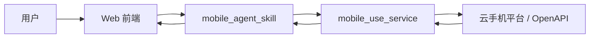
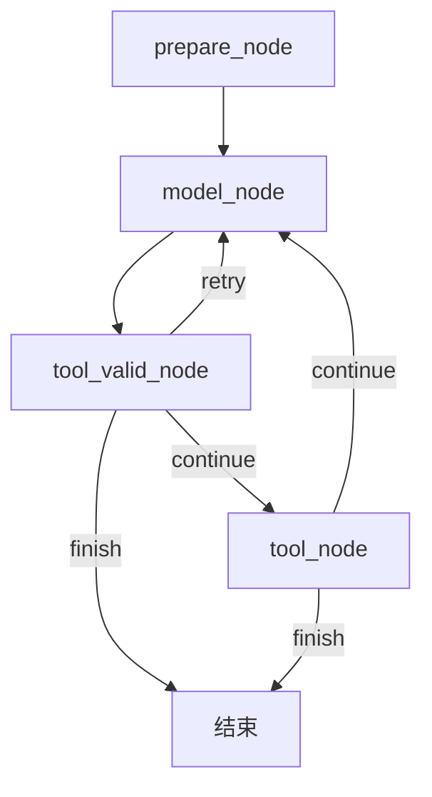
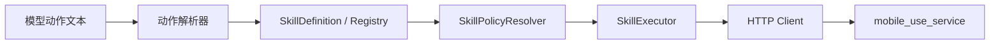
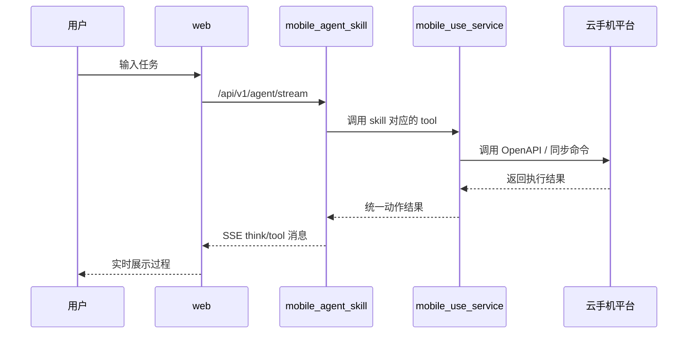

# 项目详解

## 1. 这个项目现在是做什么的

这个仓库实现了一个“让 AI 帮你操作云手机”的完整示例系统。

如果你站在用户视角看，它做的事情很简单：

1. 用户在网页里输入一句任务，比如“打开 Via 浏览器，搜索北京烤鸭”。
2. 后端 Agent 读取当前云手机截图，思考下一步该做什么。
3. Agent 把动作翻译成结构化技能调用。
4. 新版动作服务把这些技能调用变成真实的点击、输入、滑动、启动应用等操作。
5. 网页把整个过程实时展示出来。

这个仓库里虽然还保留了旧版兼容链路，但**当前默认方案**已经切换为：

```text
web -> mobile_agent_skill -> mobile_use_service -> 云手机平台
```

也就是说，现在最值得学习的，不再是旧的 `mobile_use_mcp`，而是下面这三层：

- `web/`：用户看得到的前端页面和浏览器侧代理接口
- `mobile_agent_skill/`：负责思考、解析动作、发起技能调用的 Python Agent
- `mobile_use_service/`：负责真正调用火山引擎云手机能力的新服务

## 2. 推荐先从哪里开始读

如果你是第一次读这个项目，建议用“先看大图，再看主线，再看细节”的顺序。

先看前端入口：

1. [web/src/app/chat/page.tsx](/Users/bytedance/ai-app-lab/demohouse/mobile-use/web/src/app/chat/page.tsx)
2. [web/src/hooks/useCreateSession.ts](/Users/bytedance/ai-app-lab/demohouse/mobile-use/web/src/hooks/useCreateSession.ts)
3. [web/src/lib/cloudAgent.ts](/Users/bytedance/ai-app-lab/demohouse/mobile-use/web/src/lib/cloudAgent.ts)

再看 Agent 主链：

1. [mobile_agent_skill/mobile_agent/routers/session.py](/Users/bytedance/ai-app-lab/demohouse/mobile-use/mobile_agent_skill/mobile_agent/routers/session.py)
2. [mobile_agent_skill/mobile_agent/routers/agent.py](/Users/bytedance/ai-app-lab/demohouse/mobile-use/mobile_agent_skill/mobile_agent/routers/agent.py)
3. [mobile_agent_skill/mobile_agent/agent/mobile_use_agent.py](/Users/bytedance/ai-app-lab/demohouse/mobile-use/mobile_agent_skill/mobile_agent/agent/mobile_use_agent.py)
4. [mobile_agent_skill/mobile_agent/agent/graph/nodes.py](/Users/bytedance/ai-app-lab/demohouse/mobile-use/mobile_agent_skill/mobile_agent/agent/graph/nodes.py)

最后看执行服务：

1. [mobile_agent_skill/mobile_agent/agent/mobile/doubao_action_parser.py](/Users/bytedance/ai-app-lab/demohouse/mobile-use/mobile_agent_skill/mobile_agent/agent/mobile/doubao_action_parser.py)
2. [mobile_agent_skill/mobile_agent/agent/skills/executor.py](/Users/bytedance/ai-app-lab/demohouse/mobile-use/mobile_agent_skill/mobile_agent/agent/skills/executor.py)
3. [mobile_use_service/mobile_use_service/service/mobile_use_service.py](/Users/bytedance/ai-app-lab/demohouse/mobile-use/mobile_use_service/mobile_use_service/service/mobile_use_service.py)
4. [mobile_use_service/mobile_use_service/client/volc_openapi.py](/Users/bytedance/ai-app-lab/demohouse/mobile-use/mobile_use_service/mobile_use_service/client/volc_openapi.py)

## 3. 先建立一张总图



这张图的意思是：

1. 用户把任务发给网页。
2. 网页把任务转发给新版 Python Agent。
3. Agent 先思考，再决定调用哪个技能。
4. 技能不会直接打旧 MCP，而是发给新的 `mobile_use_service`。
5. `mobile_use_service` 再去调用云手机平台的接口或兼容命令。
6. 结果沿原路返回，前端实时显示出来。

## 4. 目录结构应该怎么理解

最重要的目录如下：

```text
mobile-use/
├── mobile_agent/                 # 旧版兼容 Agent，当前不是默认方案
├── mobile_agent_skill/           # 新版默认 Agent
├── mobile_use_mcp/               # 旧版 Go MCP 服务，当前不是默认方案
├── mobile_use_service/           # 新版默认动作服务
├── web/                          # Next.js 前端
├── start.sh                      # 默认启动新版三段链路
├── README.md
└── PROJECT_EXPLAINED.zh-CN.md
```

`mobile_agent_skill/` 更像“大脑层”，负责：

- 理解用户任务
- 读取最新截图
- 决定下一步动作
- 选择要调用的技能

`mobile_use_service/` 更像“执行层”，负责：

- 接收结构化动作
- 读取当前会话身份
- 调用 OpenAPI 或兼容命令
- 返回统一格式的动作结果

`web/` 负责：

- 展示聊天界面
- 展示右侧云手机画面
- 创建和恢复 session
- 代理浏览器请求
- 渲染后端流式返回的思考和工具消息

## 5. 一次任务是怎么跑起来的

### 第一步：前端先拿到会话

相关文件：

- [web/src/hooks/useCreateSession.ts](/Users/bytedance/ai-app-lab/demohouse/mobile-use/web/src/hooks/useCreateSession.ts)
- [web/src/app/api/session/create/route.ts](/Users/bytedance/ai-app-lab/demohouse/mobile-use/web/src/app/api/session/create/route.ts)
- [mobile_agent_skill/mobile_agent/routers/session.py](/Users/bytedance/ai-app-lab/demohouse/mobile-use/mobile_agent_skill/mobile_agent/routers/session.py)

这一步会准备好：

- `thread_id`：前端这次会话的 ID
- `chat_thread_id`：Agent 内部对话记忆的 ID
- `pod_id` 和 `product_id`
- 云手机 token
- 屏幕尺寸
- 过期时间等信息

这里最容易让初学者混淆的是两个 thread：

- `thread_id`：偏“网页会话”
- `chat_thread_id`：偏“Agent 对话记忆”

### 第二步：聊天页初始化云手机

相关文件：

- [web/src/app/chat/page.tsx](/Users/bytedance/ai-app-lab/demohouse/mobile-use/web/src/app/chat/page.tsx)

聊天页会做这些事：

1. 检查本地是否已有 `threadId`
2. 检查全局状态里有没有 `sessionData`
3. 如果没有，就重新调一次创建会话接口
4. 把 pod 信息交给 vePhone 客户端
5. 启动倒计时

### 第三步：用户发送任务

相关文件：

- [web/src/lib/cloudAgent.ts](/Users/bytedance/ai-app-lab/demohouse/mobile-use/web/src/lib/cloudAgent.ts)
- [web/src/app/api/agent/stream/route.ts](/Users/bytedance/ai-app-lab/demohouse/mobile-use/web/src/app/api/agent/stream/route.ts)
- [mobile_agent_skill/mobile_agent/routers/agent.py](/Users/bytedance/ai-app-lab/demohouse/mobile-use/mobile_agent_skill/mobile_agent/routers/agent.py)

浏览器先连自己的 `/api/agent/stream`，再由这个 route 代理到 Python Agent。
Python Agent 通过 SSE 持续返回思考、工具输入、工具输出等事件，前端一边收一边渲染。

### 第四步：Agent 先截图，再思考

相关文件：

- [mobile_agent_skill/mobile_agent/agent/mobile_use_agent.py](/Users/bytedance/ai-app-lab/demohouse/mobile-use/mobile_agent_skill/mobile_agent/agent/mobile_use_agent.py)
- [mobile_agent_skill/mobile_agent/agent/graph/nodes.py](/Users/bytedance/ai-app-lab/demohouse/mobile-use/mobile_agent_skill/mobile_agent/agent/graph/nodes.py)
- [mobile_agent_skill/mobile_agent/agent/llm/doubao.py](/Users/bytedance/ai-app-lab/demohouse/mobile-use/mobile_agent_skill/mobile_agent/agent/llm/doubao.py)
- [mobile_agent_skill/mobile_agent/agent/llm/stream_pipe.py](/Users/bytedance/ai-app-lab/demohouse/mobile-use/mobile_agent_skill/mobile_agent/agent/llm/stream_pipe.py)

可以把主循环看成下面这样：



每个节点的含义如下：

- `prepare_node`：准备上下文，先给前端发一个“思考中”
- `model_node`：截图、拼 prompt、调用模型
- `tool_valid_node`：把模型动作文本解析成结构化技能
- `tool_node`：真正调用技能执行动作

## 6. skill 方案为什么能替代旧 MCP 方案

相关文件：

- [mobile_agent_skill/mobile_agent/agent/skills/definitions.py](/Users/bytedance/ai-app-lab/demohouse/mobile-use/mobile_agent_skill/mobile_agent/agent/skills/definitions.py)
- [mobile_agent_skill/mobile_agent/agent/skills/registry.py](/Users/bytedance/ai-app-lab/demohouse/mobile-use/mobile_agent_skill/mobile_agent/agent/skills/registry.py)
- [mobile_agent_skill/mobile_agent/agent/skills/policy.py](/Users/bytedance/ai-app-lab/demohouse/mobile-use/mobile_agent_skill/mobile_agent/agent/skills/policy.py)
- [mobile_agent_skill/mobile_agent/agent/skills/executor.py](/Users/bytedance/ai-app-lab/demohouse/mobile-use/mobile_agent_skill/mobile_agent/agent/skills/executor.py)
- [mobile_agent_skill/mobile_agent/agent/skills/service_client.py](/Users/bytedance/ai-app-lab/demohouse/mobile-use/mobile_agent_skill/mobile_agent/agent/skills/service_client.py)

这套设计把“模型如何决定动作”和“动作如何真正执行”拆开了。



这样做的好处是：

1. 技能定义更清晰
2. 更容易做权限控制
3. 更容易替换底层执行服务

特别是权限控制，这也是为什么 skill definition 里预留了：

- `scopes`
- `enabled_by_default`
- `risk_level`

## 7. 新版执行服务是怎么真正操作手机的

相关文件：

- [mobile_use_service/mobile_use_service/routers/mobile_use.py](/Users/bytedance/ai-app-lab/demohouse/mobile-use/mobile_use_service/mobile_use_service/routers/mobile_use.py)
- [mobile_use_service/mobile_use_service/service/mobile_use_service.py](/Users/bytedance/ai-app-lab/demohouse/mobile-use/mobile_use_service/mobile_use_service/service/mobile_use_service.py)
- [mobile_use_service/mobile_use_service/client/volc_openapi.py](/Users/bytedance/ai-app-lab/demohouse/mobile-use/mobile_use_service/mobile_use_service/client/volc_openapi.py)
- [mobile_use_service/mobile_use_service/client/commands.py](/Users/bytedance/ai-app-lab/demohouse/mobile-use/mobile_use_service/mobile_use_service/client/commands.py)

这一层可以看成两部分：

1. `mobile_use_service.py` 暴露点击、输入、截图、滑动等动作
2. `volc_openapi.py` 负责真正调用火山引擎 OpenAPI

如果某个动作更适合走兼容命令，就会借助 `commands.py` 中保存的命令常量。

也就是说：

- 能直接调高级接口时，优先调高级接口
- 不方便时，再退回到同步命令模式

## 8. 前端为什么“无感切换”

这次技术方案切换主要发生在后端，而不是前端展示层。

前端大体上仍然只做这几件事：

1. 创建会话
2. 发流式请求
3. 接收 SSE
4. 渲染消息和云手机

前端不需要知道底层现在是旧 MCP 还是新 skill 服务，只依赖这些稳定协议：

- 创建会话的返回结构
- SSE 消息结构
- 取消任务的接口

## 9. 现在默认启动的到底是哪条链路

当前默认启动的是新版：

```text
start.sh
  -> mobile_use_service :8001
  -> mobile_agent_skill :8002
  -> web               :8080
```

可以用下面这张时序图理解：



## 10. 推荐阅读顺序

如果你准备真正开始精读代码，我建议按这个顺序：

1. [PROJECT_EXPLAINED.zh-CN.md](/Users/bytedance/ai-app-lab/demohouse/mobile-use/PROJECT_EXPLAINED.zh-CN.md)
2. [web/src/app/chat/page.tsx](/Users/bytedance/ai-app-lab/demohouse/mobile-use/web/src/app/chat/page.tsx)
3. [web/src/lib/cloudAgent.ts](/Users/bytedance/ai-app-lab/demohouse/mobile-use/web/src/lib/cloudAgent.ts)
4. [mobile_agent_skill/mobile_agent/routers/session.py](/Users/bytedance/ai-app-lab/demohouse/mobile-use/mobile_agent_skill/mobile_agent/routers/session.py)
5. [mobile_agent_skill/mobile_agent/routers/agent.py](/Users/bytedance/ai-app-lab/demohouse/mobile-use/mobile_agent_skill/mobile_agent/routers/agent.py)
6. [mobile_agent_skill/mobile_agent/agent/mobile_use_agent.py](/Users/bytedance/ai-app-lab/demohouse/mobile-use/mobile_agent_skill/mobile_agent/agent/mobile_use_agent.py)
7. [mobile_agent_skill/mobile_agent/agent/graph/nodes.py](/Users/bytedance/ai-app-lab/demohouse/mobile-use/mobile_agent_skill/mobile_agent/agent/graph/nodes.py)
8. [mobile_agent_skill/mobile_agent/agent/mobile/doubao_action_parser.py](/Users/bytedance/ai-app-lab/demohouse/mobile-use/mobile_agent_skill/mobile_agent/agent/mobile/doubao_action_parser.py)
9. [mobile_agent_skill/mobile_agent/agent/skills/executor.py](/Users/bytedance/ai-app-lab/demohouse/mobile-use/mobile_agent_skill/mobile_agent/agent/skills/executor.py)
10. [mobile_use_service/mobile_use_service/service/mobile_use_service.py](/Users/bytedance/ai-app-lab/demohouse/mobile-use/mobile_use_service/mobile_use_service/service/mobile_use_service.py)
11. [mobile_use_service/mobile_use_service/client/volc_openapi.py](/Users/bytedance/ai-app-lab/demohouse/mobile-use/mobile_use_service/mobile_use_service/client/volc_openapi.py)

## 11. 一句话总结

这个项目现在最重要的学习主线是：

**前端接任务，Agent 看图思考，skill 负责抽象动作，service 负责真正执行，SSE 负责把过程实时展示出来。**
